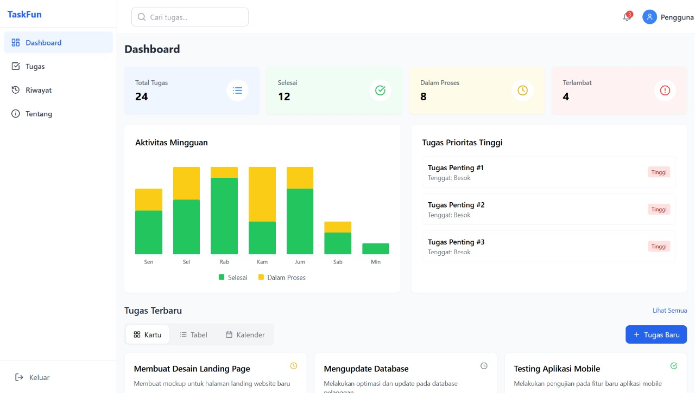
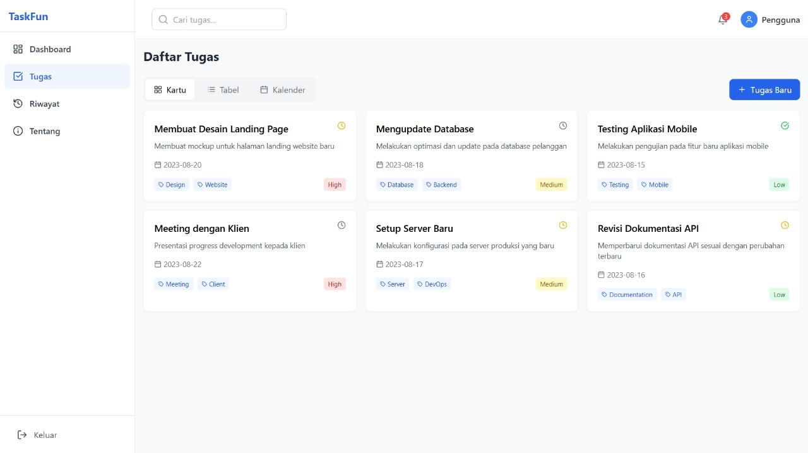
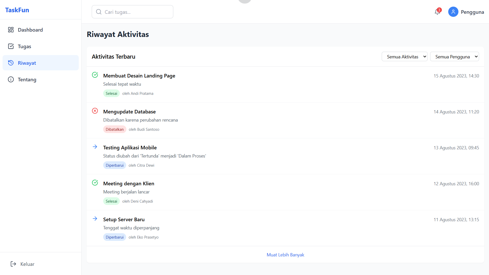

# 📋 TaskFun — Task Management App

**TaskFun** adalah aplikasi manajemen tugas modern berbasis web, dibangun dengan **React**, **Vite**, dan **TypeScript**. Aplikasi ini dirancang untuk membantu pengguna mengatur, memantau, dan mengevaluasi tugas-tugas mereka secara efisien dan menyenangkan.

---

## 🚀 Tech Stack

- ⚛️ **React** – UI Library
- ⚡ **Vite** – Fast build tool and dev server
- 🔐 **TypeScript** – Strong typing for scalable code
- 💨 **Tailwind CSS** – Utility-first CSS framework
- 📊 **Chart.js / Recharts** – Untuk visualisasi data tugas *(opsional)*

---

## ✨ Fitur Utama

### 🏠 Dashboard
- Ringkasan statistik tugas
- Grafik performa dan progres tugas

### ✅ Task View
- 📇 Mode Kartu (Card)
- 📋 Mode Tabel
- 📆 Kalender tugas (View per hari/bulan)

### 📜 History
- Riwayat tugas yang telah diselesaikan

### ℹ️ About
- Informasi tentang aplikasi

## 🖼️ Screenshot

### Dashboard


### Task View


### History View



## 🛠️ Cara Menjalankan

```bash
# 1. Clone repositori
git clone https://github.com/raimusthafa/bakery-fe.git
cd taskfun

# 2. Install dependencies
npm install

# 3. Jalankan aplikasi
npm run dev